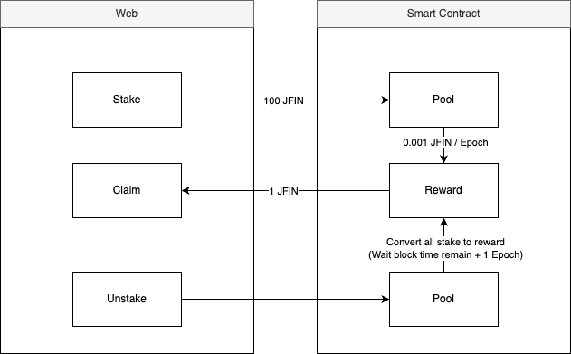

<p align="center">
  <a href="https://jfinchain.com/" target="blank"></a>
</p>
<p align="center">JFIN CHAIN BEYOND THE FUTURE.</p>

<p align="center">
    <a href="https://www.facebook.com/JFINofficial" target="_blank">
        
    </a>
    <a href="https://twitter.com/jfinofficial" target="_blank">
        
    </a>
</p>
<hr/>

<p align="center">
    Official <a href="https://github.com/jventures-jdn/jfin-all">JFIN Monorepo</a>
</p>

# Jfin Staking

## Overview

`staking-web` is a web application for staking JFIN tokens. It allows users to stake their tokens, view rewards, and interact with the JFIN blockchain seamlessly.

## Workflow



## ⚠️ Prerequisites

-   Node.js >= 16.x
-   pnpm >= 7.x

## 🔧 Installation

1. Clone the repository:

    ```bash
    git clone https://github.com/jventures-jdn/jfin-all.git
    cd jfin-all/apps/staking-web
    ```

2. Install dependencies:
    ```bash
    pnpm install
    ```

## 🚀 Usage

### Run (Development)

Mainnet

```bash
  pnpm dev:jfin
```

Testnet

```bash
pnpm dev:jfintest
```

Devnet

```bash
 pnpm dev:jfindev
```

### Build

To build the project for production, run:

```bash
pnpm build:jfin
```

The output will be located in the dist directory.

## ✈️ Deployment

The deployment process is divided into two stages: preview and release.

-   Preview: Merge your feature branch into the preview branch (e.g., staking-preview-[devnet,testnet,mainnet]).
-   Release: Merge the preview branch into the release branch (e.g., staking-release-[devnet,testnet,mainnet]).

## ⚙️ Customization

### Validator Wallets Mapping

The `VALIDATOR_WALLETS` constant is a mapping of validator wallet addresses to their respective metadata, including the validator's name and logo. This is used to display information about validators in the staking platform.

```typescript
// Path to validator wallet mapping
'jfin-all/apps/staking-web/src/utils/const.ts'
```

### Adding a New Validator

To add a new validator, simply append a new entry to the VALIDATOR_WALLETS object with the following structure:

```typescript
'0xNewWalletAddress': {
    name: 'New Validator Name',
    image: newValidatorImage,
},
```

Make sure the image path points to a valid image file in the assets/images/partners directory.

### Gas Configuration

`CHAIN_GAS_PRICE` defines the gas price for transactions on different blockchain networks. It is used to specify the cost per unit of gas for executing transactions.

```typescript
// Example
export const CHAIN_GAS_PRICE = {
    JFIN: BigInt(23000000000),
    JFINT: BigInt(23000000000),
    JFIND: BigInt(23000000000),
}
```

`CHAIN_GAS_LIMIT`specifies the default gas limit for transactions. This is used as a fallback when no specific gas limit is provided.

```typescript
// Example
export const CHAIN_GAS_LIMIT: { [key in InternalChain]: bigint } = {
    JFIN: BigInt(15000000),
    JFINT: BigInt(7000000),
    JFIND: BigInt(7000000),
}
```

`CHAIN_GAS_LIMIT_CUSTOM` provides custom gas limits for specific staking-related operations, such as staking, unstaking, and claiming rewards. This ensures that each operation has an appropriate gas limit to avoid transaction failures.

```typescript
export const CHAIN_GAS_LIMIT_CUSTOM: { [key in InternalChain]: { claim: bigint; stake: bigint } } =
    {
        JFIN: { claim: BigInt(25000000), stake: BigInt(635000) },
        JFINT: { claim: BigInt(7000000), stake: BigInt(635000) },
        JFIND: { claim: BigInt(7000000), stake: BigInt(635000) },
    }
```

To modify the gas configuration, update the corresponding values in the `utils/chain-config/src/const.ts` file. For example, to increase the gas limit for staking on the mainnet:

## Team

-   [JDN Team](https://github.com/orgs/jventures-jdn)

## Contact Us

For business inquiries: info@jventures.co.th
